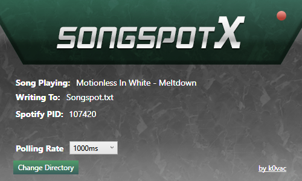

# SpotSongX
 **A lightweight Windows Utility for pulling song names from the Spotify app.**
 
SongSpotX is a program aimed for streamers, that captures the main window of the application running on your computer to figure out the song that is being played, and this is written to a separate file to be read by other programs, mainly streaming software (OBS).

## Features
- Auto-Detect: The application can automatically detect Spotify and retrieve the required information.
- Configurable: You choose where the song names are written and how often they are checked.
- Saved Config Files: Your file path and refresh rate are saved in-between sessions. Turn it back on tomorrow and continue as if you never left.

## Prerequisites
- .NET Framework 4.8 - Comes Pre-Installed with Windows 10 1903 May 2019 Update

## Contributing
Contributions to the SpotSongX project are always welcome. If you have any ideas, suggestions, or bug reports, please create an issue or submit a pull request on the GitHub repository.

## License
This project is licensed under the [Mozilla Public License](https://github.com/k0vac/SpotSongX/blob/main/LICENSE).
